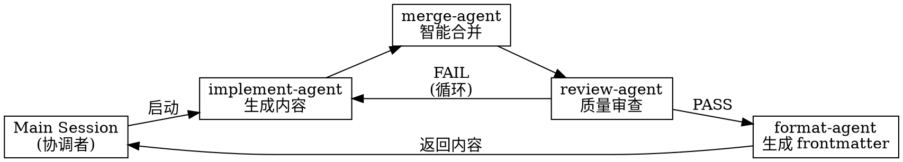

# Blog Update Skill V4 (Smart Merge)

## Core Principle
将会话中的技术讨论智能合并到 fuwari-framework 博客文章，无需用户手动选择追加/更新/保留。

## When to Use

- 用户主动调用 `/blog-update <topic>`
- Session 包含技术讨论、代码示例、配置说明
- 用户提供 `--tags [tag1,tag2]` 和 `--category <category>`
- 技术内容值得保存为博客文章

## When NOT to Use

- Topic 为空或未提供
- Session 没有与 topic 相关的内容
- 用户不需要保存会话内容为博客文章
- 用户未提供 tags 或 category（新建模式）

## Architecture Overview

## Main Session Coordination Flow

### Step 1: 检查配置文件
读取 `~/.claude/skills/blog-update/config.json`，获取 `blogBasePath` 和 `fileExtension`。

### Step 2: 检查文件存在 → 收集 tags 和 category
- 文件存在（合并模式）：从 frontmatter 自动提取 tags/category
- 文件不存在（新建模式）：向用户询问 `--tags [..] --category <..>`

### Step 3: 提取会话上下文
从当前 session 提取与 topic 相关的内容（技术讨论、代码、配置等）。

### Step 4: 启动 implement-agent
使用 `run_in_background: true` 启动 implement-agent，传递 topic 和 session_context。

### Step 5: 启动 merge-agent
implement-agent 完成后，使用 `run_in_background: true` 启动 merge-agent：
- 传递新内容
- 传递现有文件路径（如果存在）
- merge-agent 执行多粒度智能合并

### Step 6: 启动 review-agent
merge-agent 完成后，使用 `run_in_background: true` 启动 review-agent。
- PASS: 进入 Step 7
- FAIL: 将问题反馈给 implement-agent 修订，循环 Step 4-6（最多 3 次）

### Step 7: 启动 format-agent
使用 `run_in_background: true` 启动 format-agent，传递审查通过的内容和元数据。
format-agent 返回后，主会话使用 Write 工具写入文件。

### Step 8: 报告完成
向用户确认文件路径、操作类型、合并统计。

## Subagent Prompts

**REQUIRED SUBAGENTS:**
- **implement-agent:** See @prompts/implement-agent.md
- **merge-agent:** See @prompts/merge-agent.md
- **review-agent:** See @prompts/review-agent.md
- **format-agent:** See @prompts/format-agent.md

## Error Handling

| 错误场景 | 响应动作 |
|----------|----------|
| 配置文件缺失或无效 | 使用默认配置 |
| implement-agent 超时/失败 | 提示用户重试，终止执行 |
| 文件不存在 (父目录) | 创建目录结构后再写入 |
| 写入失败 | 显示错误信息，询问是否重试 |
| 空内容 | 警告用户，询问是否继续创建空框架 |
| review-agent 超时 | 提示用户重试或跳过审查 |
| 超过最大循环次数 (3次) | 提示用户手动检查内容 |
| merge-agent 合并失败 | 使用 implement-agent 内容作为最终内容 |
| format-agent 超时 | 提示用户重试 |

## Quick Reference

| 场景 | 命令格式 |
|------|----------|
| 新建文章 | `/blog-update <topic> --tags [tag1,tag2] --category <category>` |
| 更新已存在文章 | `/blog-update <topic>` (自动读取现有 tags/category) |

### Agent 执行模式

| Agent | 模式 | 职责 |
|-------|------|------|
| implement-agent | 顺序 | 生成新内容 |
| merge-agent | 后台 | 多粒度智能合并 |
| review-agent | 后台 | 质量审查 |
| format-agent | 后台 | 生成 frontmatter（不写入） |

### 写入流程
format-agent 返回内容 → 主会话 Write 工具写入文件

## Red Flags - STOP and Start Over

以下情况出现时，停止并重新评估：

- [ ] 用户未提供 `--tags` 或 `--category`（新建模式）
- [ ] Session 内容与 topic 明显不相关
- [ ] 用户要求"跳过 review" 或 "直接写入"
- [ ] 文件路径包含敏感信息（如真实密码、密钥）
- [ ] 循环超过 3 次仍无法通过 review
- [ ] merge-agent 报告无法处理的内容类型
- [ ] 用户表现出急躁或压力（"快点"、"不用太严格"）

**所有这些都意味着: 停止当前操作，检查问题后再继续。**

## Common Mistakes

| 错误 | 问题 | 正确做法 |
|------|------|----------|
| subagent 执行写入 | 沙箱权限问题导致失败 | 写入由主会话执行 |
| 跳过 review | 质量无法保证 | 必须经过 review-agent 审查 |
| 循环超过 3 次 | 陷入死循环 | 提示用户手动检查 |
| 空内容写入 | 生成空文件 | 警告用户确认 |

## Rationalization Counter

| 借口 | 反驳 |
|------|------|
| "review 太慢了，直接写进去吧" | 跳过 review 导致质量无法保证，必须执行 |
| "这次简单，不用审查了" | 所有内容都必须经过 review-agent 审查 |
| "我手动检查过了" | 手动检查不能替代 review-agent，必须执行 |
| "循环浪费时间" | 最多 3 次循环，超过后提示用户手动处理 |
