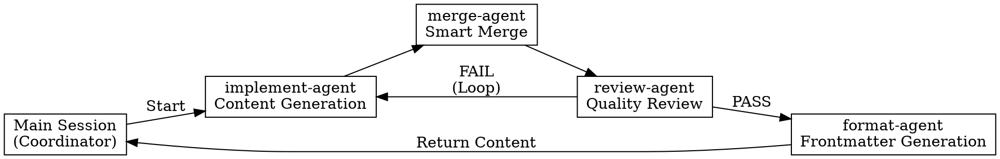

# Blog Update Skill V4 (Smart Merge)

## Core Principle
Intelligently merge technical discussion from the session into a fuwari-framework blog post, without requiring the user to manually choose append/update/preserve.

## When to Use

- User actively invokes `/blog-update <topic>`
- Session contains technical discussion, code examples, or configuration notes
- User provides `--tags [tag1,tag2]` and `--category <category>`
- Technical content is worth preserving as a blog post

## When NOT to Use

- Topic is empty or not provided
- Session has no content related to the topic
- User does not need to preserve session content as a blog post
- User has not provided tags or category (new file mode)

## Architecture Overview

## Main Session Coordination Flow

### Step 1: Check Configuration File
Read `~/.claude/skills/blog-update/config.json` to get `blogBasePath` and `fileExtension`.

### Step 2: Check File Existence -> Collect tags and category
- File exists (merge mode): Automatically extract tags/category from frontmatter
- File does not exist (new file mode): Ask user for `--tags [..] --category <..>`

### Step 3: Extract Session Context
Extract content related to the topic from the current session (technical discussion, code, configuration, etc.).

### Step 4: Launch implement-agent
Launch implement-agent with `run_in_background: true`, passing topic and session_context.

### Step 5: Launch merge-agent
After implement-agent completes, launch merge-agent with `run_in_background: true`:
- Pass new content
- Pass existing file path (if it exists)
- merge-agent performs multi-granularity smart merge

### Step 6: Launch review-agent
After merge-agent completes, launch review-agent with `run_in_background: true`.
- PASS: Proceed to Step 7
- FAIL: Feedback issues to implement-agent for revision, loop Step 4-6 (max 3 times)

### Step 7: Launch format-agent
Launch format-agent with `run_in_background: true`, passing the reviewed content and metadata.
After format-agent returns, the main session uses the Write tool to write to file.

### Step 8: Report Completion
Confirm to the user: file path, operation type, and merge statistics.

## Subagent Roles

| Agent | Role | Responsibility |
|-------|------|----------------|
| implement-agent | Content Generation Expert | Generates raw markdown content from session |
| merge-agent | Smart Merge Expert | Multi-granularity merge of new and existing content |
| review-agent | Content Quality Review Expert | Quality gate - ensures content meets standards |
| format-agent | File Formatting Expert | Generates frontmatter (write handled by main session) |

**REQUIRED SUBAGENTS:**
- **implement-agent:** See @prompts/implement-agent.md
- **merge-agent:** See @prompts/merge-agent.md
- **review-agent:** See @prompts/review-agent.md
- **format-agent:** See @prompts/format-agent.md

## Error Handling

| Error Scenario | Response Action |
|----------------|-----------------|
| Config file missing or invalid | Use default config |
| implement-agent timeout/failure | Prompt user to retry, abort execution |
| File does not exist (parent directory) | Create directory structure before writing |
| Write failed | Show error message, ask whether to retry |
| Empty content | Warn user, ask whether to continue creating empty framework |
| review-agent timeout | Prompt user to retry or skip review |
| Exceeded maximum loop count (3 times) | Prompt user to manually check content |
| merge-agent merge failed | Use implement-agent content as final content |
| format-agent timeout | Prompt user to retry |

## Quick Reference

| Scenario | Command Format |
|----------|----------------|
| Create new article | `/blog-update <topic> --tags [tag1,tag2] --category <category>` |
| Update existing article | `/blog-update <topic>` (automatically reads existing tags/category) |

### Agent Execution Mode

| Agent | Mode | Responsibility |
|-------|------|----------------|
| implement-agent | Sequential | Generate new content |
| merge-agent | Background | Multi-granularity smart merge |
| review-agent | Background | Quality review |
| format-agent | Background | Generate frontmatter (no write) |

### Write Flow
format-agent returns content -> Main session Write tool writes to file

## Red Flags - STOP and Start Over

When the following situations occur, stop and reassess:

- [ ] User has not provided `--tags` or `--category` (new file mode)
- [ ] Session content is clearly unrelated to the topic
- [ ] User requests "skip review" or "write directly"
- [ ] File path contains sensitive information (such as real passwords, keys)
- [ ] Loop exceeds 3 times and still cannot pass review
- [ ] merge-agent reports content types it cannot process
- [ ] User shows impatience or pressure ("hurry up", "don't be too strict")

**All of these mean: stop current operation, check the problem, then continue.**

## Common Mistakes

| Mistake | Problem | Correct Approach |
|---------|---------|------------------|
| subagent performs write | Sandbox permission issue causes failure | Write is performed by main session |
| Skip review | Quality cannot be guaranteed | Must go through review-agent review |
| Loop exceeds 3 times | Falls into infinite loop | Prompt user to manually check |
| Empty content write | Generates empty file | Warn user to confirm |

## Rationalization Counter

| Excuse | Counter |
|--------|---------|
| "review is too slow, just write it in" | Skipping review leads to unGuaranteed quality, must execute |
| "This is simple, no review needed" | All content must go through review-agent review |
| "I manually checked it" | Manual check cannot replace review-agent, must execute |
| "Looping wastes time" | Maximum 3 loops, beyond that prompt user to handle manually |
